### 版权申明：已登记知识产权！完全独创的作品，希望大家到手后自己用就行！一定不要贩卖！

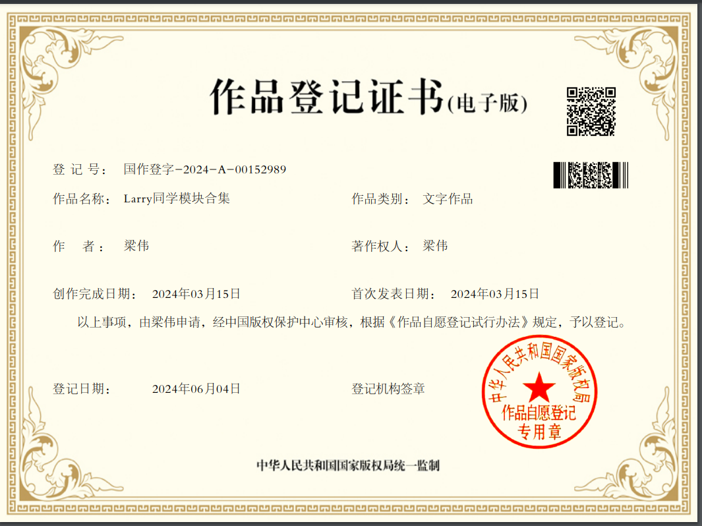

# 前言:

大家好！我是Larry同学，主要来给大家讲一下最近一段时间，一直在准备一个东西。非常炸裂，就是很多同学私信我，说我之前整理的哪些模块，确实有用，但是还是别人论文的，有没有更具体点的，我当时没反应过来！后面我明白了，这个就是我和当时上研究生的时候，有同样的一个想法！有没有那种模块就是独创的，我拿来直接就写，也不用担心和别人撞车，创新点重复。受到这个启发，我这段时间就一直在想，要怎么做，才能满足这种要求呢？于是我决定，行。我试试。我做了5个独创模块，对的，独创的，也就是大家现在想象的那样，完全就是新的模块，没有发表过论文的！这5个模块，你可以理解为就是5个独立的创新点，每个都是单独存在的。直接用在你的论文里面，写上去就完事。


### 那么大家的疑问来了：如果买的人很多，岂不是都撞车了，创新点重复？ 

这个我得好好讲讲！其实并没有，因为首先大家的各自研究的领域不同，方向不同，并且你们各自用到的主干网络不同，你把这这5个创新模块中的其中一个加进去，组成新的模型，这完全就是新东西。


举个例子：我们先看重复的概率！

小王  用的 主干网络A  

小李  用的 主干网络B

小崔  用的 主干网络C

就假装世面上所有的主干网络就10个，够极端把。


然后每个人的领域方向不同，这个可就太多了，100个人里面看能不能挑出两个相同的方向的，大方向可能相同，但是细小方向是不同的。就例如分割同样是分割，这个就有什么钢材的分割，医学分割，医学上的分割比如牙齿分割，足步分割，更别提里面还有包括什么红外图像，激光，这些等等。市面上最常见的YOLO目标检测,这是不是人最多，但因为检测的数据集不同，也完全属于不同方向。你要说YOLO都烂大街了，还能发论文？我同门刚中了一篇C会，就是用的YOLO加我的模块，就中了。一篇CCF-C大多数学校还是能毕业的。所以绕会正题。每个人的方向就假装只有1000个。那么把这些模块，和你的模型，以及你自己领域的数据集，排列组合。完全就是新东西。


### 创新【不重复】=模型A+模块B+自己方向数据集+【自己也可以稍作修改一下模块】


说这些的原因就是给小白大致讲解下，可能不是你们想象中创新点会撞车！并且你们看过论文也知道，还是有很多直接拿这些模块直接写论文，也能发论文。

接着看一个实际的例子：最经典的注意力模块是不是SENet。我们看下他的引用量3W多。这个模块是不是已经是世面上有的了。


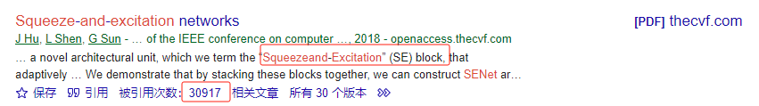


紧接着我随便在知网上找了一篇23年的文章，你们看摘要和标题。就是直接写基于SENet这个模块，意思就是别人模块都可以直接拿来用到自己方向和领域上。更何况这些独创的模块。你把它直接融合到你的模型上，完全是OK的。并且是也创新点。非要说这个创新点够不够，我实践的经历告诉了，大家可以看我之前发过动态，确实能中CCF-B类C类，以及SCI再投的也有几篇。总结一点，我就是这么过来的，大家也能这么过来，不想藏着掖着。只要你写的没问题，故事讲的还行。

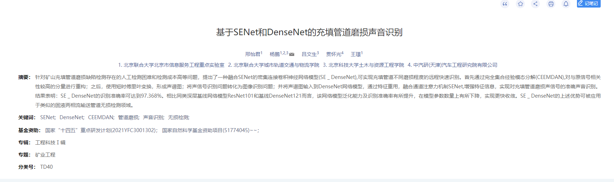


### 关于这5个创新模块，我会提供：

1. #### 模块名称

2. #### 模块图

3. #### 模块描述

4. #### 为什么要设计这样的模块

5. #### 模块代码及每行注释

6. #### 模块参数量

7. #### 实验结果

8. #### 模型图源件PPT [直接可以修改的]


### 注意：【非常非常非常重要】

##### 在这里我还是强调一下实验结果。特别说明一下，因为有些模块用在你的模型上，适用你的数据集，结果很好了。直接可以写了。相反如果结果都没有提升，或者极端情况，反而下降了。是不是就不能写了？不是哈。创新点，创新点，首先是创新。结果只是一方面，你只要把这个思想架构说通顺，让审稿人及编辑觉得你这个东西确实很新。有想法。一样是可以发论文的。所以我们的思路一定要转变过来。因为都去追求和sota比，也就是与最好的模型比。那人人都是最好的。这一点也不现实。所以大家一定要有信心！并不是什么难事！我自己也是学生，看过视频的同学都知道。我就是靠这些发论文的，我就这点东西。

##### 加模块，只要加进去不掉点就是成功。很多模块加进去掉很多点。所以与模型不相上下，甚至高一点点。简直难能可贵！并且结果放在不同位置，效果也会不同！比如第一个模块MDFA模块，我在实验结果部分，对比了模块加载到网络不同的位置，出现几种不同结果！所以大家记住话语权是掌握在自己手中的！

#### 我鼓励大家稍作修改，图可以换个颜色，结构顺序也可以换一下，确保模块适应自己的研究。即使实验结果不理想，关键在于创新思想，只要结构合理，有新意，就能发表论文。总结一句话：自圆其说。希望这些模块能帮助大家顺利完成论文写作。


# ---------------------------------正式进入主题-------------------------------


# 模块1 ：MDFA (多尺度空洞融合模块)

### 1. 模块图

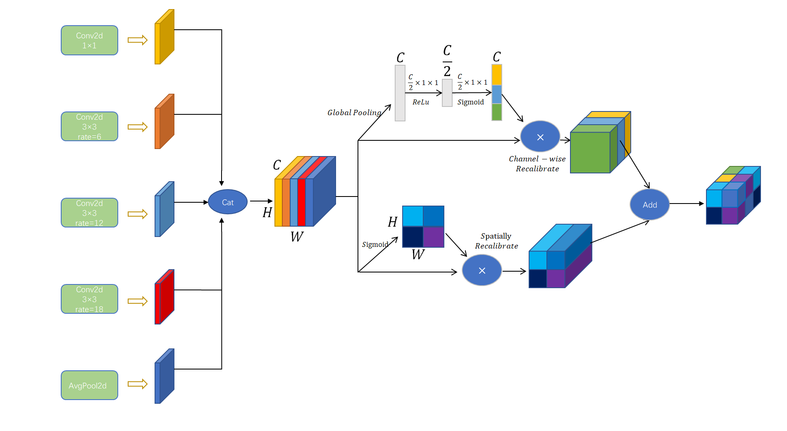

### 2. 模块描述

多尺度空洞融合注意力模块（MDFA）旨在通过利用多种空洞率并整合通道和空间注意力机制来增强特征表达。该设计满足了同时捕获图像中的细节信息和广泛上下文信息的需求，这对于复杂的视觉任务如语义分割和目标检测至关重要。【这里你就可以说用在你的方向领域上至关重要。】

我们这个模块分为两部分，第一部分就是多尺度空洞卷积部分，第二部分是通道和空间注意力的融合。【我只会为了让大家理解。所以基本用的是口水话，大家理解图的结构以及代码后。可自行模仿SCI论文或者会议，看下其他人怎么描述自己的模型。下面是看图说话】

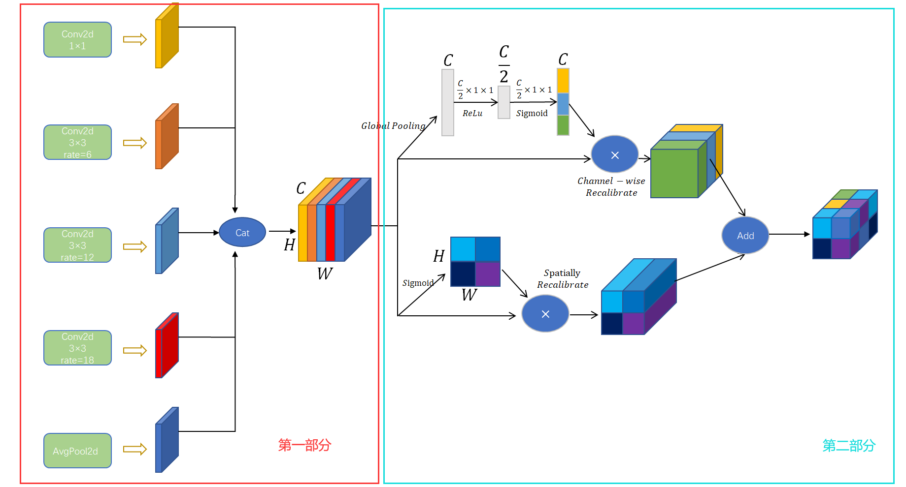

首先大家先看第一部分多尺度空洞卷积！我们的MDFA架构通过五个并行的卷积分支来实现不同尺度的特征提取，每个分支配置有不同的空洞率，以扩大感受野并捕捉不同范围的空间信息：

- **第一分支**使用1x1卷积核，不改变空间尺度，直接提取特征。

- **第二分支**使用3x3卷积核，空洞率为6，适中地扩大感受野。

- **第三分支**使用3x3卷积核，空洞率为12，进一步扩大感受野以捕获更广泛的上下文信息。

- **第四分支**使用3x3卷积核，空洞率为18，提供最广的感受野。

- **第五分支**是用的一个额外的全局平均池化分支被用来提取全局上下文特征，增强模型对于整体布局的理解能力。

  

紧接着我们来看第二部分通道和空间特征合并与校准。前面是不是五个不同分支提取不同尺度的特征，然后在通道维度上进行拼接，合成一个综合的特征图。这个合并后的特征图并行经过两种注意力机制的校准：上面是通道注意力机制，下面是空间注意力机制。

- **通道注意力机制**：首先，对综合特征图进行全局平均池化（Global Pooling），得到每个通道的全局特征。然后，通过两个全连接层（分别使用ReLU和Sigmoid激活函数）学习每个通道的重要性权重。最后，将这些权重与原始特征图逐通道相乘，实现通道加权。

- **空间注意力机制**：对综合特征图在通道维度上进行全局池化，得到空间特征图。通过一个1x1卷积和Sigmoid激活函数，学习每个空间位置的重要性权重。将这些权重与原始特征图逐元素相乘，实现空间加权。

  

最后通道注意力和空间注意力机制的输出特征图通过元素加法（Add）操作进行融合，最终得到增强后的特征图。此时分别经过通道和空间校准的特征图与原始合并特征图进行元素加和操作，以整合和增强相关特征。增强后的特征图最后通过一个1x1卷积层进行降维和整合，生成最终的输出特征图。


### 3. 为什么要设计这样的模块？【背景+解决方案】

下面就解释为什么要设计这样的模块？这样对于你写论文的时候，你自己清楚。并且当你们的导师问你，为啥这样设计呢？是不是汗流浃背了！此时你可以看看下面的回答。


#### 3.1 **多尺度空洞卷积的设计理由**【前面五个分支中的上面四个空洞卷积分支】

**背景**：

在图像处理任务中，对象可以出现在不同的尺寸和形状。传统的卷积层通常具有固定的感受野，这限制了其在不同尺度上捕捉特征的能力。

**解决方案**：

通过引入多尺度空洞卷积（使用不同的空洞率），MDFA能够在不同的空间尺度上提取特征。**第一个就是增加感受野：**传统的卷积网络通过堆叠多层卷积层来增加感受野，但这种方法会导致计算量大增，且可能会导致信息的稀释。使用空洞卷积，尤其是不同的空洞率，可以在不丢失解析度的情况下显著扩大感受野，这对于捕捉图像中更广泛的上下文信息至关重要。**第二个就是捕获多尺度信息：**在图像处理任务中，尤其是语义分割和目标检测等，对象可以出现在不同的尺寸和形状。通过并行的多个空洞率，网络能够同时捕捉到不同尺度的特征，这有助于提高模型对图像中各种尺度特征的适应性和识别能力。


#### 3.2 **全局特征提取的设计理由**【前面五个分支中的下面一个全局池化分支】
**背景+解决方案：**

全局平均池化能够提取出整个图像的全局特征，这对于理解整体场景结构非常有帮助。将这些全局信息融入局部特征中，可以帮助网络更好地理解图像中的每一个部分与整体的关系，从而做出更准确的决策。


#### 3.3 **通道和空间注意力机制的设计理由**【第二部分中的上面是通道注意力分支，下面是空间注意力分支】

**背景**：

卷积神经网络中的不同通道往往表示不同的特征或模式。然而，在处理复杂的图像时，某些通道可能包含比其他通道更有用的信息。传统的卷积操作不能动态	地调整通道的重要性。此外，不同的空间位置包含的信息重要性可能不同。例如，目标对象的区域比背景更重要。传统的卷积操作对所有空间位置一视同仁，	不能突出关键区域。

**解决方案**：

第一个就是引入通道注意力：通过评估每个通道的重要性并进行相应的调整，可以强化有用的特征通道，抑制不重要的通道，从而提高特征表示的质量。第二	个就是引入空间注意力：关注图像中特定区域的重要性，有助于模型集中处理那些对最终任务影响最大的局部区域。


#### 3.4 **特征合并与输出的设计理由**【最后的输出合并】

**背景**：

为了提升模型的整体性能，需要将多尺度特征与注意力机制有效地结合起来。单独使用任何一种技术都无法全面提升模型的性能。

**解决方案**：

通过将多尺度空洞卷积的输出特征在通道维度上拼接，并结合通道和空间注意力机制进行权重调整，MDFA能够融合多个视角的特征：将不同空洞卷积层和全	局特征合并，可以确保网络不仅仅关注局部细节，同时也兼顾全局信息。这种设计使得网络的输出更加全面，增强了模型在各种场景下的泛化能力。通过最后	的1x1卷积进行特征降维，不仅可以减少后续计算量，还可以整合来自不同分支的信息，生成对最终任务更为有效的特征表示。


### 4.  代码+注释

```python
import torch
from torch import nn
import torch.nn.functional as F

class tongdao(nn.Module):  #处理通道部分   函数名就是拼音名称
    # 通道模块初始化，输入通道数为in_channel
    def __init__(self, in_channel):
        super().__init__()
        self.avg_pool = nn.AdaptiveAvgPool2d(1)  # 自适应平均池化，输出大小为1x1
        self.fc = nn.Conv2d(in_channel, 1, kernel_size=1, bias=False)  # 1x1卷积用于降维
        self.relu = nn.ReLU(inplace=True)  # ReLU激活函数，就地操作以节省内存

    # 前向传播函数
    def forward(self, x):
        b, c, _, _ = x.size()  # 提取批次大小和通道数
        y = self.avg_pool(x)  # 应用自适应平均池化
        y = self.fc(y)  # 应用1x1卷积
        y = self.relu(y)  # 应用ReLU激活
        y = nn.functional.interpolate(y, size=(x.size(2), x.size(3)), mode='nearest')  # 调整y的大小以匹配x的空间维度
        return x * y.expand_as(x)  # 将计算得到的通道权重应用到输入x上，实现特征重校准

class kongjian(nn.Module):
    # 空间模块初始化，输入通道数为in_channel
    def __init__(self, in_channel):
        super().__init__()
        self.Conv1x1 = nn.Conv2d(in_channel, 1, kernel_size=1, bias=False)  # 1x1卷积用于产生空间激励
        self.norm = nn.Sigmoid()  # Sigmoid函数用于归一化

    # 前向传播函数
    def forward(self, x):
        y = self.Conv1x1(x)  # 应用1x1卷积
        y = self.norm(y)  # 应用Sigmoid函数
        return x * y  # 将空间权重应用到输入x上，实现空间激励

class hebing(nn.Module):    #函数名为合并, 意思是把空间和通道分别提取的特征合并起来
    # 合并模块初始化，输入通道数为in_channel
    def __init__(self, in_channel):
        super().__init__()
        self.tongdao = tongdao(in_channel)  # 创建通道子模块
        self.kongjian = kongjian(in_channel)  # 创建空间子模块

    # 前向传播函数
    def forward(self, U):
        U_kongjian = self.kongjian(U)  # 通过空间模块处理输入U
        U_tongdao = self.tongdao(U)  # 通过通道模块处理输入U
        return torch.max(U_tongdao, U_kongjian)  # 取两者的逐元素最大值，结合通道和空间激励


class MDFA(nn.Module):                       ##多尺度空洞融合注意力模块。
    def __init__(self, dim_in, dim_out, rate=1, bn_mom=0.1):# 初始化多尺度空洞卷积结构模块，dim_in和dim_out分别是输入和输出的通道数，rate是空洞率，bn_mom是批归一化的动量
        super(MDFA, self).__init__()
        self.branch1 = nn.Sequential(# 第一分支：使用1x1卷积，保持通道维度不变，不使用空洞
            nn.Conv2d(dim_in, dim_out, 1, 1, padding=0, dilation=rate, bias=True),
            nn.BatchNorm2d(dim_out, momentum=bn_mom),
            nn.ReLU(inplace=True),
        )
        self.branch2 = nn.Sequential( # 第二分支：使用3x3卷积，空洞率为6，可以增加感受野
            nn.Conv2d(dim_in, dim_out, 3, 1, padding=6 * rate, dilation=6 * rate, bias=True),
            nn.BatchNorm2d(dim_out, momentum=bn_mom),
            nn.ReLU(inplace=True),
        )
        self.branch3 = nn.Sequential( # 第三分支：使用3x3卷积，空洞率为12，进一步增加感受野
            nn.Conv2d(dim_in, dim_out, 3, 1, padding=12 * rate, dilation=12 * rate, bias=True),
            nn.BatchNorm2d(dim_out, momentum=bn_mom),
            nn.ReLU(inplace=True),
        )
        self.branch4 = nn.Sequential(# 第四分支：使用3x3卷积，空洞率为18，最大化感受野的扩展
            nn.Conv2d(dim_in, dim_out, 3, 1, padding=18 * rate, dilation=18 * rate, bias=True),
            nn.BatchNorm2d(dim_out, momentum=bn_mom),
            nn.ReLU(inplace=True),
        )
        self.branch5_conv = nn.Conv2d(dim_in, dim_out, 1, 1, 0, bias=True) # 第五分支：全局特征提取，使用全局平均池化后的1x1卷积处理
        self.branch5_bn = nn.BatchNorm2d(dim_out, momentum=bn_mom)
        self.branch5_relu = nn.ReLU(inplace=True)

        self.conv_cat = nn.Sequential( # 合并所有分支的输出，并通过1x1卷积降维
            nn.Conv2d(dim_out * 5, dim_out, 1, 1, padding=0, bias=True),
            nn.BatchNorm2d(dim_out, momentum=bn_mom),
            nn.ReLU(inplace=True),
        )
        self.Hebing=hebing(in_channel=dim_out*5)# 整合通道和空间特征的合并模块

    def forward(self, x):
        [b, c, row, col] = x.size()
        # 应用各分支
        conv1x1 = self.branch1(x)
        conv3x3_1 = self.branch2(x)
        conv3x3_2 = self.branch3(x)
        conv3x3_3 = self.branch4(x)
        # 全局特征提取
        global_feature = torch.mean(x, 2, True)
        global_feature = torch.mean(global_feature, 3, True)
        global_feature = self.branch5_conv(global_feature)
        global_feature = self.branch5_bn(global_feature)
        global_feature = self.branch5_relu(global_feature)
        global_feature = F.interpolate(global_feature, (row, col), None, 'bilinear', True)
        # 合并所有特征
        feature_cat = torch.cat([conv1x1, conv3x3_1, conv3x3_2, conv3x3_3, global_feature], dim=1)
        # 应用合并模块进行通道和空间特征增强
        larry=self.Hebing(feature_cat)
        larry_feature_cat=larry*feature_cat
        # 最终输出经过降维处理
        result = self.conv_cat(larry_feature_cat)

        return result


if __name__ == '__main__':
    input = torch.randn(3, 32, 64, 64)  # 随机生成输入数据
    model = MDFA(dim_in=32,dim_out=32)  # 实例化模块
    output = model(input)  # 将输入通过模块处理
    print(output.shape)  # 输出处理后的数据形状

```


### 5. 模块参数量大小

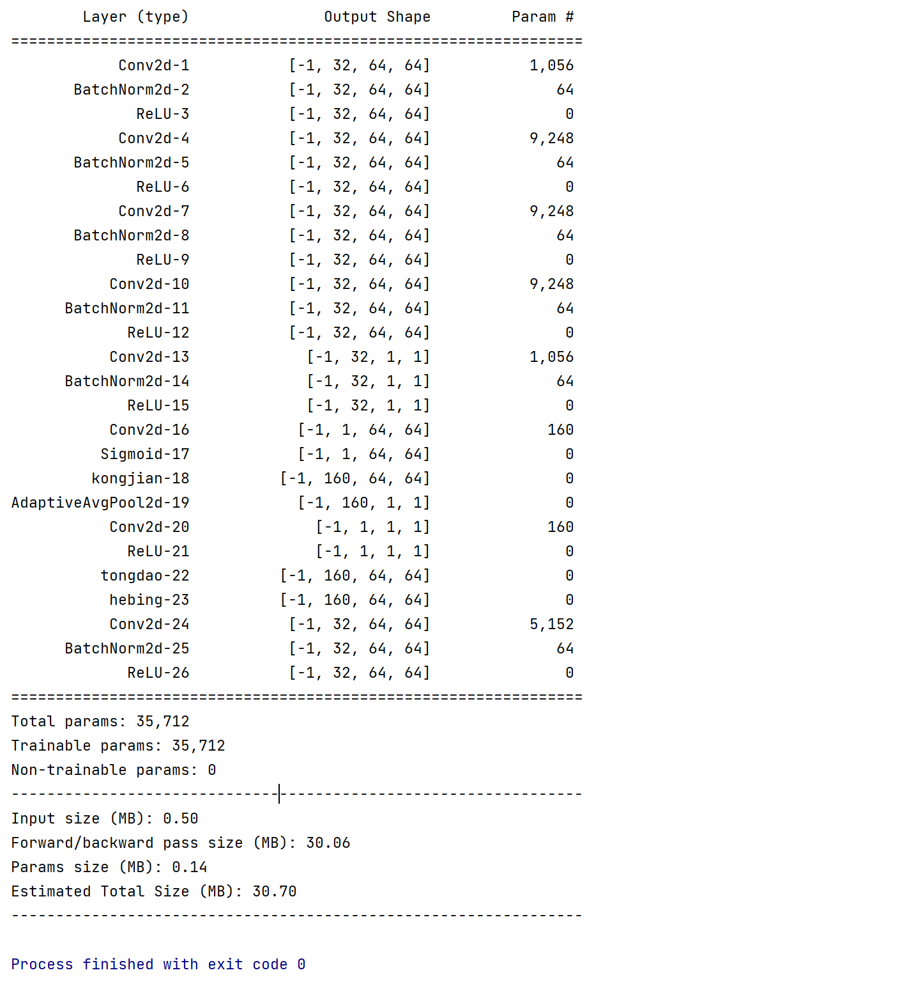

如果你想自己测试模块参数量:只用加入这个代码:[后面想测试参数量,都可以用此代码。其他4个模块就不一一介绍怎么测试参数量！]

```python
#第一步:首先需要安装 torchsummary 库：
pip install torchsummary
#第二步:引入torchsummary库，在代码中引入 torchsummary 库：
from torchsummary import summary
#第三步：在测试用例中调用summary函数，也就是在main主函数下直接调用即可。
summary(block, (64, 32, 32))#summary(第一个参数 ,第二个参数),这个函数有两个参数,第一个参数填实例化的模型,第二个参数填输入尺寸
```

完整版模块+测试参数量代码如下：

```python
import torch
from torch import nn
import torch.nn.functional as F
from torchsummary import summary

class tongdao(nn.Module):  #处理通道部分   函数名就是拼音名称
    # 通道模块初始化，输入通道数为in_channel
    def __init__(self, in_channel):
        super().__init__()
        self.avg_pool = nn.AdaptiveAvgPool2d(1)  # 自适应平均池化，输出大小为1x1
        self.fc = nn.Conv2d(in_channel, 1, kernel_size=1, bias=False)  # 1x1卷积用于降维
        self.relu = nn.ReLU(inplace=True)  # ReLU激活函数，就地操作以节省内存

    # 前向传播函数
    def forward(self, x):
        b, c, _, _ = x.size()  # 提取批次大小和通道数
        y = self.avg_pool(x)  # 应用自适应平均池化
        y = self.fc(y)  # 应用1x1卷积
        y = self.relu(y)  # 应用ReLU激活
        y = nn.functional.interpolate(y, size=(x.size(2), x.size(3)), mode='nearest')  # 调整y的大小以匹配x的空间维度
        return x * y.expand_as(x)  # 将计算得到的通道权重应用到输入x上，实现特征重校准

class kongjian(nn.Module):
    # 空间模块初始化，输入通道数为in_channel
    def __init__(self, in_channel):
        super().__init__()
        self.Conv1x1 = nn.Conv2d(in_channel, 1, kernel_size=1, bias=False)  # 1x1卷积用于产生空间激励
        self.norm = nn.Sigmoid()  # Sigmoid函数用于归一化

    # 前向传播函数
    def forward(self, x):
        y = self.Conv1x1(x)  # 应用1x1卷积
        y = self.norm(y)  # 应用Sigmoid函数
        return x * y  # 将空间权重应用到输入x上，实现空间激励

class hebing(nn.Module):    #函数名为合并, 意思是把空间和通道分别提取的特征合并起来
    # 合并模块初始化，输入通道数为in_channel
    def __init__(self, in_channel):
        super().__init__()
        self.tongdao = tongdao(in_channel)  # 创建通道子模块
        self.kongjian = kongjian(in_channel)  # 创建空间子模块

    # 前向传播函数
    def forward(self, U):
        U_kongjian = self.kongjian(U)  # 通过空间模块处理输入U
        U_tongdao = self.tongdao(U)  # 通过通道模块处理输入U
        return torch.max(U_tongdao, U_kongjian)  # 取两者的逐元素最大值，结合通道和空间激励


class MDFA(nn.Module):                       ##多尺度空洞卷积融合空间及通道特征。
    def __init__(self, dim_in, dim_out, rate=1, bn_mom=0.1):# 初始化多尺度空洞卷积结构模块，dim_in和dim_out分别是输入和输出的通道数，rate是空洞率，bn_mom是批归一化的动量
        super(MDFA, self).__init__()
        self.branch1 = nn.Sequential(# 第一分支：使用1x1卷积，保持通道维度不变，不使用空洞
            nn.Conv2d(dim_in, dim_out, 1, 1, padding=0, dilation=rate, bias=True),
            nn.BatchNorm2d(dim_out, momentum=bn_mom),
            nn.ReLU(inplace=True),
        )
        self.branch2 = nn.Sequential( # 第二分支：使用3x3卷积，空洞率为6，可以增加感受野
            nn.Conv2d(dim_in, dim_out, 3, 1, padding=6 * rate, dilation=6 * rate, bias=True),
            nn.BatchNorm2d(dim_out, momentum=bn_mom),
            nn.ReLU(inplace=True),
        )
        self.branch3 = nn.Sequential( # 第三分支：使用3x3卷积，空洞率为12，进一步增加感受野
            nn.Conv2d(dim_in, dim_out, 3, 1, padding=12 * rate, dilation=12 * rate, bias=True),
            nn.BatchNorm2d(dim_out, momentum=bn_mom),
            nn.ReLU(inplace=True),
        )
        self.branch4 = nn.Sequential(# 第四分支：使用3x3卷积，空洞率为18，最大化感受野的扩展
            nn.Conv2d(dim_in, dim_out, 3, 1, padding=18 * rate, dilation=18 * rate, bias=True),
            nn.BatchNorm2d(dim_out, momentum=bn_mom),
            nn.ReLU(inplace=True),
        )
        self.branch5_conv = nn.Conv2d(dim_in, dim_out, 1, 1, 0, bias=True) # 第五分支：全局特征提取，使用全局平均池化后的1x1卷积处理
        self.branch5_bn = nn.BatchNorm2d(dim_out, momentum=bn_mom)
        self.branch5_relu = nn.ReLU(inplace=True)

        self.conv_cat = nn.Sequential( # 合并所有分支的输出，并通过1x1卷积降维
            nn.Conv2d(dim_out * 5, dim_out, 1, 1, padding=0, bias=True),
            nn.BatchNorm2d(dim_out, momentum=bn_mom),
            nn.ReLU(inplace=True),
        )
        self.Hebing=hebing(in_channel=dim_out*5)# 整合通道和空间特征的合并模块

    def forward(self, x):
        [b, c, row, col] = x.size()
        # 应用各分支
        conv1x1 = self.branch1(x)
        conv3x3_1 = self.branch2(x)
        conv3x3_2 = self.branch3(x)
        conv3x3_3 = self.branch4(x)
        # 全局特征提取
        global_feature = torch.mean(x, 2, True)
        global_feature = torch.mean(global_feature, 3, True)
        global_feature = self.branch5_conv(global_feature)
        global_feature = self.branch5_bn(global_feature)
        global_feature = self.branch5_relu(global_feature)
        global_feature = F.interpolate(global_feature, (row, col), None, 'bilinear', True)
        # 合并所有特征
        feature_cat = torch.cat([conv1x1, conv3x3_1, conv3x3_2, conv3x3_3, global_feature], dim=1)
        # 应用合并模块进行通道和空间特征增强
        larry=self.Hebing(feature_cat)
        larry_feature_cat=larry*feature_cat
        # 最终输出经过降维处理
        result = self.conv_cat(larry_feature_cat)

        return result


if __name__ == '__main__':
    input = torch.randn(3, 32, 64, 64).cuda()  # 随机生成输入数据
    model = MDFA(dim_in=32,dim_out=32).cuda()  # 实例化模块
    output = model(input)  # 将输入通过模块处理
    print(output.shape)  # 输出处理后的数据形状
	
    summary(model, (32, 64, 64))# 使用 torchsummary 打印模型详细信息
```


### 6.  实验结果

#### 前提条件：

我们都已相同的标准，相同的配置参数。直接对比模块提升效果。这些实验都是在15000张分类中测试的效果。我觉得目标检测，或者分割等等。这个模块应该效果还行。

【大家可以试试这个模块。还有模块加哪里，也是一门玄学。我说实话，我至今没搞懂，哈哈。因为有时间同样的模型，我放主干网络，效果差，但是放在输出的位置，效果又极好。搞不明白！所以多试试，总没错！实在没提点，也不要丧气。模型的创新有了，也能发论文。下面就是我加在不同位置效果图】

##### 因为全部跑完比较费时。我们都以第10轮为基准参考。大致就能看看效果怎么样！


#### 原模型的结果：

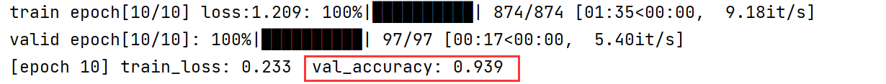


#### 第一种情况：

加入MDFA模块，并且加在网络的第一层后面的结果：看见没，加在这个位置还不如原模型，直接掉点。效果巨差。但是此时心态要稳住。我们继续放其他位置！

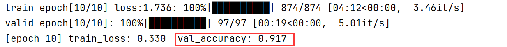


#### 第二种情况：

加入MDFA模块，并且加在网络的最后一层后面的结果：是不是很神奇，同样的模块，加在不同的位置，差距尽然这么大。加在最后一层，效果感觉还可以，因为这个分类任务本身任务不难，所以准确度本身就非常高。但是这证明了模块是有效果的，并且和我所说的模块放在不同位置。效果是不同的。所以波动很大。但是总归有效果。所以后面的模块大家都可以试试！多尝试放在不同位置！实在没效果，一样可以写。原因已经说过了。后续只放结果！就不在这么多的废话了！

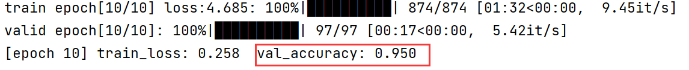


# 模块2 ：GGCA  (全局分组坐标注意力)

### 1. 模块图


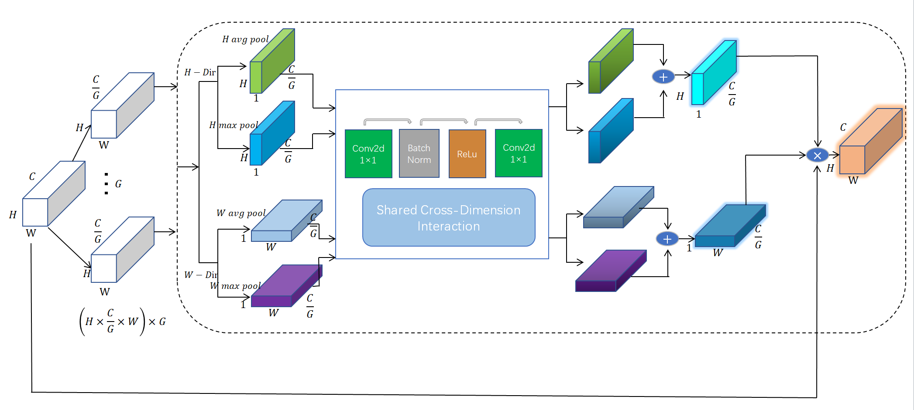

### 2. 模块描述

我们提出的全局分组坐标注意力模块 (GGCA) 旨在利用特征图在空间维度（高度和宽度）上的全局信息来生成注意力图，并通过这些注意力图对输入特征图进行加权，增强特征表达能力。该模块的具体结构如图所示。

#### 2.1 特征图分组
首先，对于输入特征图
$$
\mathbf{X} \in \mathbb{R}^{B \times C \times H \times W}
$$
我们按照通道数将其分为 *G* 组，每组包含 *C/G* 个通道。这里，*B *是批大小，*C* 是通道数，*H* 和 *W*  分别是特征图的高度和宽度。分组后的特征图表示为：
$$
\mathbf{X} \in \mathbb{R}^{B \times G \times \frac{C}{G} \times H \times W}
$$

#### 2.2 全局池化
然后，我们对分组后的特征图在高度方向和宽度方向分别进行全局平均池化和全局最大池化操作：
$$
\begin{align*}
\mathbf{X}_{h,\text{avg}} &= \text{AvgPool}(\mathbf{X}) \in \mathbb{R}^{B \times G \times \frac{C}{G} \times H \times 1} \\
\mathbf{X}_{h,\text{max}} &= \text{MaxPool}(\mathbf{X}) \in \mathbb{R}^{B \times G \times \frac{C}{G} \times H \times 1} \\
\mathbf{X}_{w,\text{avg}} &= \text{AvgPool}(\mathbf{X}) \in \mathbb{R}^{B \times G \times \frac{C}{G} \times 1 \times W} \\
\mathbf{X}_{w,\text{max}} &= \text{MaxPool}(\mathbf{X}) \in \mathbb{R}^{B \times G \times \frac{C}{G} \times 1 \times W}
\end{align*}
$$


#### 2.3 共享卷积层
对于每个分组特征图，我们应用共享的卷积层进行特征处理。该共享卷积层由两个1×1卷积层、批量归一化层和 ReLU  激活函数组成，用于降低和恢复通道维度：
$$
\mathbf{Y}_{h,\text{avg}} = \text{Conv}(\mathbf{X}_{h,\text{avg}}), \quad \mathbf{Y}_{h,\text{max}} = \text{Conv}(\mathbf{X}_{h,\text{max}}) \\
\mathbf{Y}_{w,\text{avg}} = \text{Conv}(\mathbf{X}_{w,\text{avg}}), \quad \mathbf{Y}_{w,\text{max}} = \text{Conv}(\mathbf{X}_{w,\text{max}})
$$


#### 2.4 注意力权重计算
通过将卷积层的输出相加，并应用 Sigmoid 激活函数，生成高度方向和宽度方向的注意力权重：
$$
\begin{align*}
\mathbf{A}_h &= \sigma(\mathbf{Y}_{h,\text{avg}} + \mathbf{Y}_{h,\text{max}}) \in \mathbb{R}^{B \times G \times \frac{C}{G} \times H \times 1} \\
\mathbf{A}_w &= \sigma(\mathbf{Y}_{w,\text{avg}} + \mathbf{Y}_{w,\text{max}}) \in \mathbb{R}^{B \times G \times \frac{C}{G} \times 1 \times W}
\end{align*}
$$

其中，σ表示 Sigmoid 激活函数。


#### 2.5 应用注意力权重
最后，我们将输入特征图按注意力权重进行加权，得到输出特征图：
$$
\mathbf{O} = \mathbf{X} \times \mathbf{A}_h \times \mathbf{A}_w \in \mathbb{R}^{B \times C \times H \times W}
$$
这里，注意力权重Ah和Aw 会分别在高度和宽度方向上扩展以匹配输入特征图的尺寸。


### 3. 为什么要设计这样的模块?【背景+解决方案】

#### 3.1 多维度全局信息捕捉的设计理由

**背景：**

传统卷积神经网络在处理复杂视觉任务时，缺乏同时捕捉高度和宽度两个空间维度上的全局信息的能力，导致特征表达能力受限。

**解决方案：**

GGCA模块通过在高度和宽度方向上分别进行全局平均池化和最大池化，捕捉多维度的全局信息，提升特征提取的全面性。


#### 3.2 增强特征表达能力

**背景：**

不同通道和空间位置的特征重要性不一样，传统卷积操作不能动态调整特征的重要性，无法突出关键特征。

**解决方案：**

GGCA模块通过共享卷积层和注意力机制，生成高度和宽度方向的注意力图，对输入特征图进行加权，增强重要特征的表达，抑制不重要的特征。


#### 3.3 通过分组减少计算复杂度

**背景：**

在处理高分辨率图像和大规模数据时，计算复杂度和内存开销是重要的考虑因素。

**解决方案：**

GGCA模块通过分组处理，将输入特征图按通道数分组，减少每组特征图的计算量，同时保持特征表达的多样性和丰富性。


#### 3.4 结合多维度信息和注意力机制的设计理由

**背景：**

单一的注意力机制（如通道注意力或空间注意力）在捕捉特征信息时有局限性，不能同时利用多维度的全局信息。

**解决方案：**

GGCA模块结合了多维度全局信息和注意力机制，通过多维度全局信息的捕捉和特征增强，显著提升模型的表现，特别是在复杂的视觉任务中。


### 4. 代码+注释

```python
import torch
from torch import nn


class GGCA(nn.Module):  #(Global Grouped Coordinate Attention) 全局分组坐标注意力
    def __init__(self, channel, h, w, reduction=16, num_groups=4):
        super(GGCA, self).__init__()
        self.num_groups = num_groups  # 分组数
        self.group_channels = channel // num_groups  # 每组的通道数
        self.h = h  # 高度方向的特定尺寸
        self.w = w  # 宽度方向的特定尺寸

        # 定义H方向的全局平均池化和最大池化
        self.avg_pool_h = nn.AdaptiveAvgPool2d((h, 1))  # 输出大小为(h, 1)
        self.max_pool_h = nn.AdaptiveMaxPool2d((h, 1))
        # 定义W方向的全局平均池化和最大池化
        self.avg_pool_w = nn.AdaptiveAvgPool2d((1, w))  # 输出大小为(1, w)
        self.max_pool_w = nn.AdaptiveMaxPool2d((1, w))

        # 定义共享的卷积层，用于通道间的降维和恢复
        self.shared_conv = nn.Sequential(
            nn.Conv2d(in_channels=self.group_channels, out_channels=self.group_channels // reduction,
                      kernel_size=(1, 1)),
            nn.BatchNorm2d(self.group_channels // reduction),
            nn.ReLU(inplace=True),
            nn.Conv2d(in_channels=self.group_channels // reduction, out_channels=self.group_channels,
                      kernel_size=(1, 1))
        )
        # 定义sigmoid激活函数
        self.sigmoid_h = nn.Sigmoid()
        self.sigmoid_w = nn.Sigmoid()

    def forward(self, x):
        batch_size, channel, height, width = x.size()
        # 确保通道数可以被分组数整除,一般分组数,要选择整数,不然不能被整除。而且是小一点.groups选择4挺好。
        assert channel % self.num_groups == 0, "The number of channels must be divisible by the number of groups."

        # 将输入特征图按通道数分组
        x = x.view(batch_size, self.num_groups, self.group_channels, height, width)

        # 分别在H方向进行全局平均池化和最大池化
        x_h_avg = self.avg_pool_h(x.view(batch_size * self.num_groups, self.group_channels, height, width)).view(
            batch_size, self.num_groups, self.group_channels, self.h, 1)
        x_h_max = self.max_pool_h(x.view(batch_size * self.num_groups, self.group_channels, height, width)).view(
            batch_size, self.num_groups, self.group_channels, self.h, 1)

        # 分别在W方向进行全局平均池化和最大池化
        x_w_avg = self.avg_pool_w(x.view(batch_size * self.num_groups, self.group_channels, height, width)).view(
            batch_size, self.num_groups, self.group_channels, 1, self.w)
        x_w_max = self.max_pool_w(x.view(batch_size * self.num_groups, self.group_channels, height, width)).view(
            batch_size, self.num_groups, self.group_channels, 1, self.w)

        # 应用共享卷积层进行特征处理
        y_h_avg = self.shared_conv(x_h_avg.view(batch_size * self.num_groups, self.group_channels, self.h, 1))
        y_h_max = self.shared_conv(x_h_max.view(batch_size * self.num_groups, self.group_channels, self.h, 1))

        y_w_avg = self.shared_conv(x_w_avg.view(batch_size * self.num_groups, self.group_channels, 1, self.w))
        y_w_max = self.shared_conv(x_w_max.view(batch_size * self.num_groups, self.group_channels, 1, self.w))

        # 计算注意力权重
        att_h = self.sigmoid_h(y_h_avg + y_h_max).view(batch_size, self.num_groups, self.group_channels, self.h, 1)
        att_w = self.sigmoid_w(y_w_avg + y_w_max).view(batch_size, self.num_groups, self.group_channels, 1, self.w)

        # 应用注意力权重
        out = x * att_h * att_w
        out = out.view(batch_size, channel, height, width)

        return out


if __name__ == '__main__':
    block = GGCA(channel=64, h=32, w=32, reduction=16, num_groups=4).cuda() # 初始化GGCA模块
    input = torch.rand(16, 64, 32, 32).cuda()  # 四维输入：batch size, channels, height, width
    output = block(input) # 将输入通过GGCA模块处理
    print(output.shape) # 输出处理后的数据形状
```

### 5. 模型参数量大小

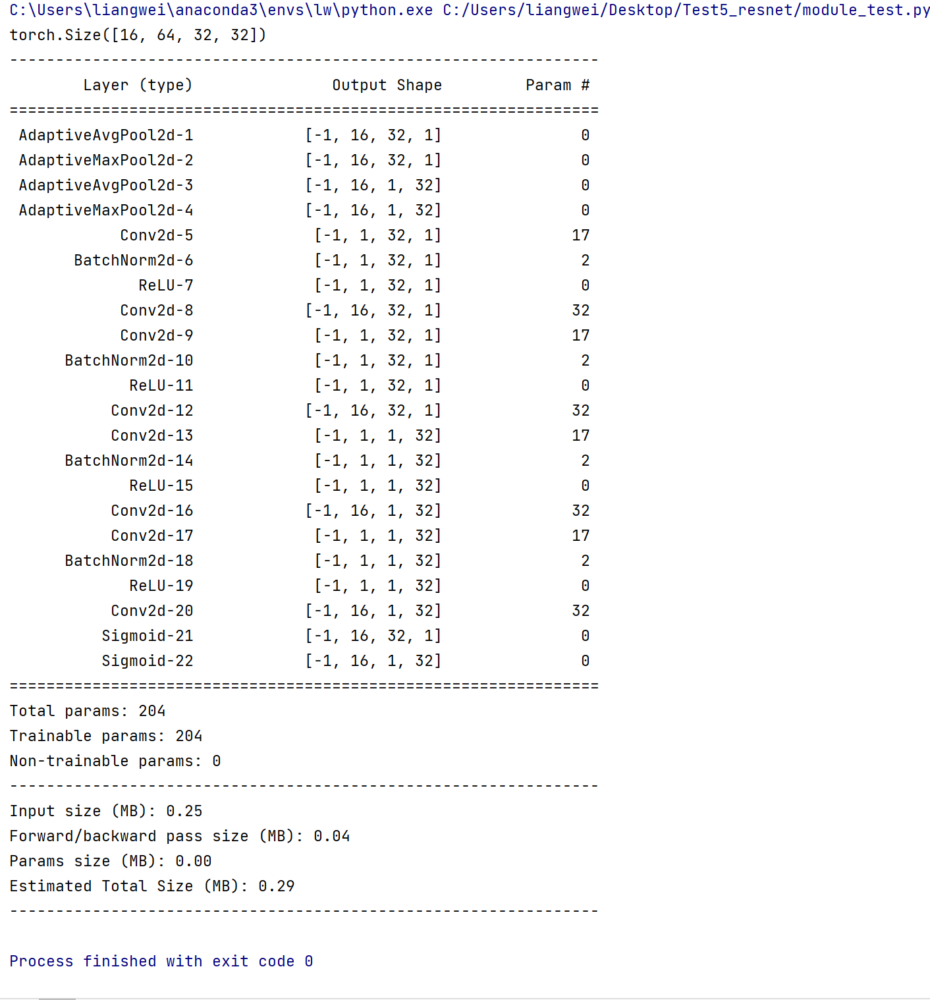


### 6. 实验结果

##### 原模型的结果：93.9 

##### 加入GGCA模块后，效果提升1.2 【这个模块我也很推荐试试。效果应该还不错】

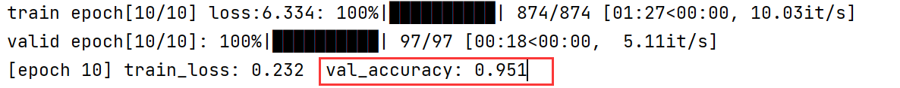


# 模块3 : GCSA 全局通道空间注意力

### 1. 模块图

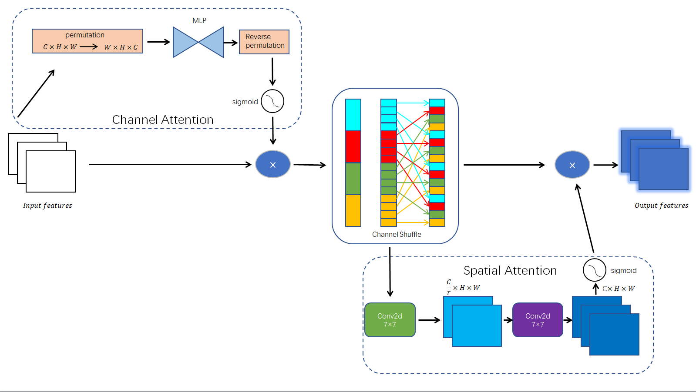

### 2. 模块描述

我们设计了一种全局通道-空间注意力模块（GCSA），以增强输入特征图的表达能力。该模块结合了通道注意力、通道洗牌和空间注意力机制，旨在捕捉特征图中的全局依赖关系。具体流程如下所示：

#### 2.1 输入特征
输入特征图先送入通道注意力子模块随后进入空间注意力子模块。初始特征图包含多个通道，每个通道的空间尺寸为  H×W 。


#### 2.2 通道注意力子模块
在通道注意力子模块中，输入特征图首先进行维度置换，从C×H×W 变换到 W×H×C。接着，通过两层的多层感知器 MLP 对通道间依赖关系进行捕捉。第一层MLP将通道数缩减为原来的 \( 1/4 \) 倍，随后通过ReLU激活函数引入非线性，再通过第二层MLP将通道数恢复到原始维度。最后，进行逆置换恢复到C×H×W，并通过Sigmoid激活函数生成通道注意力图。输入特征图和通道注意力图逐元素相乘，得到增强的特征图:
$$
\mathbf{F}_\text{channel}=σ(MLP(Permute(\mathbf{F}_\text{input})))⊙\mathbf{F}_\text{input}
$$

$$
其中，\mathbf{F}_\text{channel}是增强后的特征图，σ是Sigmoid函数，⊙表示逐元素相乘，\mathbf{F}_\text{input}是原始输入特征图
$$


#### 2.3 通道洗牌（Channel Shuffle）
为了进一步混合和共享信息，应用通道洗牌操作。增强后的特征图被分成 \( 4 \) 组，每组包含 \( C/4 \) 个通道。对分组后的特征图进行转置操作，打乱各组内的通道顺序。随后，将打乱后的特征图恢复为原始形状 \( C×H×W \)。这种方式能够更好地混合特征信息，增强特征表达能力。
$$
\mathbf{F}_\text{shuffle}=ChannelShuffle(\mathbf{F}_\text{channel})
$$

$$
其中，\mathbf{F}_\text{shuffle}是混洗后的特征图，\mathbf{F}_\text{channel}是输入特征图的通道数
$$


#### 2.4 空间注意力子模块

在空间注意力子模块中，输入特征图经过一个7x7卷积层，通道数缩减为原来的 \( 1/4 \) 倍。然后，经过批归一化和ReLU激活函数进行非线性变换。接着，通过第二个7x7卷积层将通道数恢复到原始维度 C ，再经过批归一化层。最后，通过Sigmoid激活函数生成空间注意力图。洗牌后的特征图和空间注意力图逐元素相乘，得到最终的输出特征图。
$$
Fspatial=σ(Conv(BN(ReLU(Conv(Fshuffle)))))⊙Fshuffle
$$

$$
其中，\mathbf{F}_\text{spatial} 是经过空间注意力后的特征图。
$$


#### 2.5 **输出特征图**

最终的输出特征图包含了经过通道注意力、通道洗牌和空间注意力后的增强特征。


### 3. 为什么要设计这样的模块?[背景+解决方案]

#### 3.1 通道注意力子模块

**背景**：

在传统的卷积神经网络中，通道间的关系可能被忽略，而这些关系对于捕捉全局信息非常重要。如果不考虑通道间的依赖关系，模型可能无法充分利用特征图中的所有信息，导致对全局特征的捕捉不足。

**解决方案**：

为了增强通道间的依赖关系，我们在通道注意力子模块中采用了多层感知器（MLP）。通过多层感知器（MLP）来实现通道注意力，可以减少通道间的冗余信息，并突出重要的特征。首先，将输入特征图的维度置换，使得通道维度在最后一维。然后，通过两层MLP进行处理，第一层将通道数缩减为原来的1/4，通过ReLU激活函数引入非线性，再通过第二层将通道数恢复到原始维度。通过这种方式，可以更好地捕捉通道间的全局依赖关系。最后，逆置换恢复原始维度，并通过Sigmoid激活函数生成通道注意力图。输入特征图与通道注意力图逐元素相乘，得到增强的特征图。


#### 3.2 通道洗牌（Channel Shuffle）

**背景**：

在通道注意力增强后，仍可能存在通道间的信息未充分混合的问题。如果通道间的信息没有得到充分混合，特征表达能力可能会受到限制，无法充分发挥通道注意力的效果。

**解决方案**：

为了解决这一问题，通道洗牌操作被引入。增强后的特征图被分成若干组（例如4组），每组包含总通道数的1/4。对这些分组后的特征图进行转置操作，打乱各组内的通道顺序。随后，将打乱后的特征图恢复为原始形状。这种方式能够在不同通道之间更好地混合信息，增强特征表达能力，从而提升模型的性能。


#### 3.3 空间注意力子模块

**背景**：

仅通过通道注意力和通道洗牌操作，可能无法充分利用空间信息，而空间信息对于捕捉图像中的局部和全局特征同样重要。如果不考虑空间维度的信息，模型可能会忽略特征图中的重要细节。

**解决方案**：

在空间注意力子模块中，我们通过两个7x7卷积层来处理空间信息。首先，输入特征图经过一个7x7卷积层，通道数缩减为原来的1/4。然后，经过批归一化和ReLU激活函数进行非线性变换，接着通过第二个7x7卷积层将通道数恢复到原始维度，再经过批归一化层。通过这种方式，可以更好地捕捉空间维度的依赖关系。最后，通过Sigmoid激活函数生成空间注意力图。洗牌后的特征图与空间注意力图逐元素相乘，得到最终的输出特征图。


### 4. 代码+注释

```python
import torch.nn as nn
import torch

# 定义GAM_Attention类
class GCSA(nn.Module):
    def __init__(self, in_channels, rate=4):
        super(GCSA, self).__init__()

        # 通道注意力子模块
        self.channel_attention = nn.Sequential(
            nn.Linear(in_channels, int(in_channels / rate)),  # 线性层，将通道数缩减到1/rate
            nn.ReLU(inplace=True),  # ReLU激活函数
            nn.Linear(int(in_channels / rate), in_channels)  # 线性层，将通道数恢复到原始大小
        )

        # 空间注意力子模块
        self.spatial_attention = nn.Sequential(
            nn.Conv2d(in_channels, int(in_channels / rate), kernel_size=7, padding=3),  # 7x7卷积，通道数缩减到1/rate
            nn.BatchNorm2d(int(in_channels / rate)),  # 批归一化
            nn.ReLU(inplace=True),  # ReLU激活函数
            nn.Conv2d(int(in_channels / rate), in_channels, kernel_size=7, padding=3),  # 7x7卷积，恢复到原始通道数
            nn.BatchNorm2d(in_channels)  # 批归一化
        )

    # 通道洗牌操作函数
    def channel_shuffle(self, x, groups):
        batchsize, num_channels, height, width = x.size()
        channels_per_group = num_channels // groups
        # 调整形状，分组
        x = x.view(batchsize, groups, channels_per_group, height, width)
        # 转置，打乱组内通道
        x = torch.transpose(x, 1, 2).contiguous()
        # 恢复原始形状
        x = x.view(batchsize, -1, height, width)

        return x

    # 前向传播函数
    def forward(self, x):
        b, c, h, w = x.shape  # 获取输入张量的形状
        x_permute = x.permute(0, 2, 3, 1).view(b, -1, c)  # 调整形状，便于通道注意力操作
        x_att_permute = self.channel_attention(x_permute).view(b, h, w, c)  # 应用通道注意力
        x_channel_att = x_att_permute.permute(0, 3, 1, 2).sigmoid()  # 调整回原始形状，并应用Sigmoid激活函数

        x = x * x_channel_att  # 将输入特征图与通道注意力图逐元素相乘

        x = self.channel_shuffle(x, groups=4) # 添加通道洗牌操作[根据自己的任务设定组数,2也行,大于4也行，看效果选择]

        x_spatial_att = self.spatial_attention(x).sigmoid()  # 应用空间注意力，并应用Sigmoid激活函数

        out = x * x_spatial_att  # 将输入特征图与空间注意力图逐元素相乘

        return out  # 返回输出特征图

# 测试代码
if __name__ == '__main__':
    x = torch.randn(1, 64, 20, 20)  # 创建随机输入张量
    b, c, h, w = x.shape  # 获取输入张量的形状
    net = GCSA(in_channels=c)  # 初始化GAM_Attention模块
    y = net(x)  # 前向传播
    print(y.size())  # 打印输出张量的形状

```


### 5. 模型参数量大小

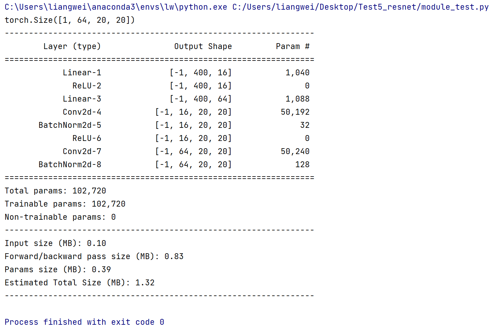

### 6. 实验结果

##### 原模型结果: 93.9

##### 加入GCSA模块后,效果提升1.8【效果也还行】

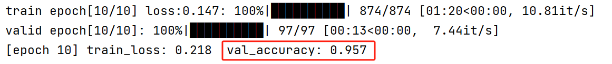


# 模块4 : MECS (中值增强空间通道注意力)

### 1. 模块图

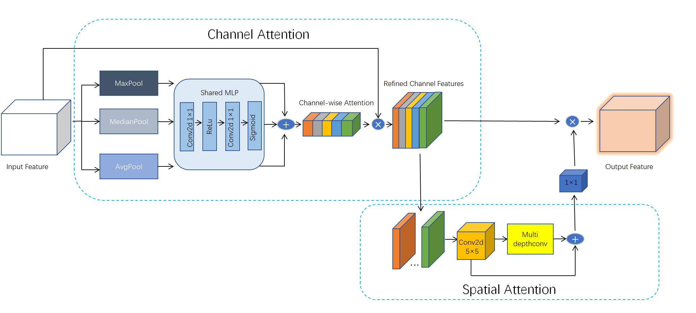

### 2. 模块描述

我们提出了一种中值增强的空间和通道注意力块（Median-enhanced Spatial and Channel Attention Block, MECS），以有效地提升特征提取的能力。MECS模块结合了通道注意力和空间注意力机制，能够在不同尺度上捕捉和融合特征。以下是MECS模块的详细描述。

#### 2.1 通道注意力机制

通道注意力机制通过聚合输入特征图的全局统计信息，生成通道注意力图，从而加权输入特征的通道。具体过程如下：

1. **池化操作**：
   对输入特征图进行全局平均池化（AvgPool）、全局最大池化（MaxPool）和全局中值池化（MedianPool），得到三个不同的池化结果。每个池化结果的尺寸均为 
   $$
   \mathbb{R}^{C \times 1 \times 1}
   $$
   其中 \(C\) 为通道数。

   

2. **共享 MLP 处理**： 
   将每个池化结果通过共享的多层感知器（MLP），MLP 包含两个 1 x 1 卷积层和一个 ReLU 激活函数。第一个卷积层将特征维度从 \(C\) 降到 \(C/r\)，其中 \(r\) 为降维比率，第二个卷积层将特征维度恢复到 \(C\)。最后，使用 Sigmoid 激活函数将输出值压缩到 [0, 1] 范围内，得到三个注意力图。

   

3. **融合池化结果**：
   将三个池化结果的注意力图进行元素级相加，得到最终的通道注意力图。

   

4. **加权输入特征图**：
   将通道注意力图与原始输入特征图进行元素级相乘，得到加权后的特征图。

公式如下：
$$
F_{c} = \sigma(\text{MLP}(\text{AvgPool}(F))) + \sigma(\text{MLP}(\text{MaxPool}(F))) + \sigma(\text{MLP}(\text{MedianPool}(F)))
$$

$$
F' = F_{c} \odot F
$$

其中，σ 表示 Sigmoid 函数，⊙ 表示元素级相乘。


#### 2.2 空间注意力机制

空间注意力机制通过多尺度深度卷积捕捉输入特征图的空间关系，并生成空间注意力图。具体过程如下：

1. **初始卷积层**：
   输入特征图首先通过一个5 × 5 的深度卷积层，提取基础特征。该卷积层的输出尺寸与输入相同。

   

2. **多尺度深度卷积**：
   将初始卷积层的输出特征图分别通过多个不同尺寸的深度卷积层，包括不同尺寸的卷积，有1×11,1×7等等，进一步提取多尺度特征。

   

3. **特征融合**：
   将所有深度卷积层的输出进行元素级相加，得到融合后的特征图。

   

4. **生成空间注意力图**：
   将融合后的特征图通过一个 1 x 1 卷积层，生成最终的空间注意力图。该注意力图与通道加权后的特征图进行元素级相乘，得到最终的输出特征图。

公式如下：

$$
F_{s} = \sum_{i=1}^{n} D_{i}(F')
$$

$$
F'' = \text{Conv1x1}(F_{s}) \odot F'
$$

$$
其中，表示不同尺寸的深度卷积操作，n 表示深度卷积的数量，\text{Conv1x1} 表示 1 × 1 卷积操作。
$$


### 3. 为什么要设计这样的模块?[背景+解决方案]

#### 3.1 整体设计

**背景**：

在计算机视觉任务中，模型的性能很大程度上依赖于其特征提取能力。传统的卷积神经网络虽然能够捕捉到图像的局部特征，但在处理全局信息和多尺度特征时存在一定的局限性。此外，如何在保证高效性的同时，增强模型对噪声的鲁棒性，也是一个重要的研究课题。

**解决方案**：

我们提出了一种中值增强的空间和通道注意力块（MECS），结合了通道注意力和空间注意力机制，旨在提升特征提取的效果和鲁棒性。通道注意力通过全局池化操作提取全局统计信息，空间注意力通过多尺度深度卷积捕捉不同尺度的空间特征。整体设计旨在提供更丰富的特征表示，增强模型的性能。


#### 3.2 中值增强的通道注意力机制

**背景：**

现有的通道注意力机制通常使用全局平均池化和全局最大池化来提取特征图的全局统计信息。然而，这些方法在处理噪声时表现不足，特别是在输入特征图中存在显著噪声的情况下，这些噪声可能会影响特征提取的质量。中值池化在图像处理任务中被广泛应用于去除噪声，因为它能够在保留重要特征信息的同时去除噪声。

**解决方案：**

为了解决噪声问题并增强通道注意力机制的鲁棒性，我们在通道注意力机制中引入了中值池化操作，结合全局平均池化和全局最大池化，形成了一种更加鲁棒的通道注意力机制。


#### 3.3 空间注意力子模块

**背景**：

单一尺度的卷积核可能无法充分捕捉特征图中的多尺度信息，从而限制了模型在处理不同尺度和复杂度特征时的表现。多尺度特征提取方法可以更好地捕捉到特征图中的不同尺度和方向的信息，从而提升模型在处理复杂场景和不同对象时的表现。

**解决方案**：

在空间注意力子模块中，我们设计了一种多尺度深度卷积的方法。首先，输入特征图经过一个 5×5 卷积层，提取基础特征。然后，将这些基础特征图分别通过多个不同尺寸的深度卷积层，包括不同尺寸的深度卷积等，进一步提取多尺度特征。最后，将这些多尺度特征逐元素相加，再通过一个 1 x 1 卷积层生成空间注意力图。加权后的特征图与空间注意力图逐元素相乘，得到最终的输出特征图。


### 4. 代码+注释

```python
import torch
from torch import nn
import torch.nn.functional as F


def global_median_pooling(x):  #对输入特征图进行全局中值池化操作。

    median_pooled = torch.median(x.view(x.size(0), x.size(1), -1), dim=2)[0]
    median_pooled = median_pooled.view(x.size(0), x.size(1), 1, 1)
    return median_pooled #全局中值池化后的特征图，尺寸为 (batch_size, channels, 1, 1)


class ChannelAttention(nn.Module):
    def __init__(self, input_channels, internal_neurons):
        super(ChannelAttention, self).__init__()
        # 定义两个 1x1 卷积层，用于减少和恢复特征维度
        self.fc1 = nn.Conv2d(in_channels=input_channels, out_channels=internal_neurons, kernel_size=1, stride=1,
                             bias=True)
        self.fc2 = nn.Conv2d(in_channels=internal_neurons, out_channels=input_channels, kernel_size=1, stride=1,
                             bias=True)
        self.input_channels = input_channels

    def forward(self, inputs):
        avg_pool = F.adaptive_avg_pool2d(inputs, output_size=(1, 1)) # 全局平均池化
        max_pool = F.adaptive_max_pool2d(inputs, output_size=(1, 1))# 全局最大池化
        median_pool = global_median_pooling(inputs)# 全局中值池化

        # 处理全局平均池化后的输出
        avg_out = self.fc1(avg_pool)# 通过第一个 1x1 卷积层减少特征维度
        avg_out = F.relu(avg_out, inplace=True) # 应用 ReLU 激活函数
        avg_out = self.fc2(avg_out)# 通过第二个 1x1 卷积层恢复特征维度
        avg_out = torch.sigmoid(avg_out) # 使用 Sigmoid 激活函数，将输出值压缩到 [0, 1] 范围内

        # 处理全局最大池化后的输出
        max_out = self.fc1(max_pool)# 通过第一个 1x1 卷积层减少特征维度
        max_out = F.relu(max_out, inplace=True) # 应用 ReLU 激活函数
        max_out = self.fc2(max_out) # 通过第二个 1x1 卷积层恢复特征维度
        max_out = torch.sigmoid(max_out) # 使用 Sigmoid 激活函数，将输出值压缩到 [0, 1] 范围内

        # 处理全局中值池化后的输出
        median_out = self.fc1(median_pool) # 通过第一个 1x1 卷积层减少特征维度
        median_out = F.relu(median_out, inplace=True) # 应用 ReLU 激活函数
        median_out = self.fc2(median_out) # 通过第二个 1x1 卷积层恢复特征维度
        median_out = torch.sigmoid(median_out) # 使用 Sigmoid 激活函数，将输出值压缩到 [0, 1] 范围内

        # 将三个池化结果的注意力图进行元素级相加
        out = avg_out + max_out + median_out
        return out


class MECS(nn.Module):
    def __init__(self, in_channels, out_channels, channel_attention_reduce=4):
        super(MECS , self).__init__()

        self.C = in_channels
        self.O = out_channels
        # 确保输入和输出通道数相同
        assert in_channels == out_channels, "Input and output channels must be the same"
        # 初始化通道注意力模块
        self.channel_attention = ChannelAttention(input_channels=in_channels,
                                                  internal_neurons=in_channels // channel_attention_reduce)

        # 定义 5x5 深度卷积层
        self.initial_depth_conv = nn.Conv2d(in_channels, in_channels, kernel_size=5, padding=2, groups=in_channels)

        # 定义多个不同尺寸的深度卷积层
        self.depth_convs = nn.ModuleList([

            nn.Conv2d(in_channels, in_channels, kernel_size=(1, 7), padding=(0, 3), groups=in_channels),
            nn.Conv2d(in_channels, in_channels, kernel_size=(7, 1), padding=(3, 0), groups=in_channels),
            nn.Conv2d(in_channels, in_channels, kernel_size=(1, 11), padding=(0, 5), groups=in_channels),
            nn.Conv2d(in_channels, in_channels, kernel_size=(11, 1), padding=(5, 0), groups=in_channels),
            nn.Conv2d(in_channels, in_channels, kernel_size=(1, 21), padding=(0, 10), groups=in_channels),
            nn.Conv2d(in_channels, in_channels, kernel_size=(21, 1), padding=(10, 0), groups=in_channels),
        ])
        # 定义 1x1 卷积层和激活函数
        self.pointwise_conv = nn.Conv2d(in_channels, in_channels, kernel_size=1, padding=0)
        self.act = nn.GELU()

    def forward(self, inputs):
        # 全局感知机
        inputs = self.pointwise_conv(inputs) #图中我画是先进入channel_attention，但是代码实际先进入pointwise_conv，不影响哈。
        inputs = self.act(inputs)

        # 通道注意力
        channel_att_vec = self.channel_attention(inputs)
        inputs = channel_att_vec * inputs

        # 先经过 5x5 深度卷积层
        initial_out = self.initial_depth_conv(inputs)

        # 空间注意力
        spatial_outs = [conv(initial_out) for conv in self.depth_convs]
        spatial_out = sum(spatial_outs)

        # 应用空间注意力
        spatial_att = self.pointwise_conv(spatial_out)
        out = spatial_att * inputs
        out = self.pointwise_conv(out)
        return out


if __name__ == '__main__':
    # 假设输入数据
    batch_size = 4
    channels = 16
    height = 64
    width = 64
    input_tensor = torch.randn(batch_size, channels, height, width).cuda()

    # 初始化 MECS 块
    cpca_block = MECS (in_channels=16, out_channels=16, channel_attention_reduce=4).cuda()

    # 通过 MECS 块处理输入
    output_tensor = cpca_block(input_tensor)

    # 打印输出张量的形状
    print(f"Output shape: {output_tensor.shape}")

```


### 5. 模型参数量大小

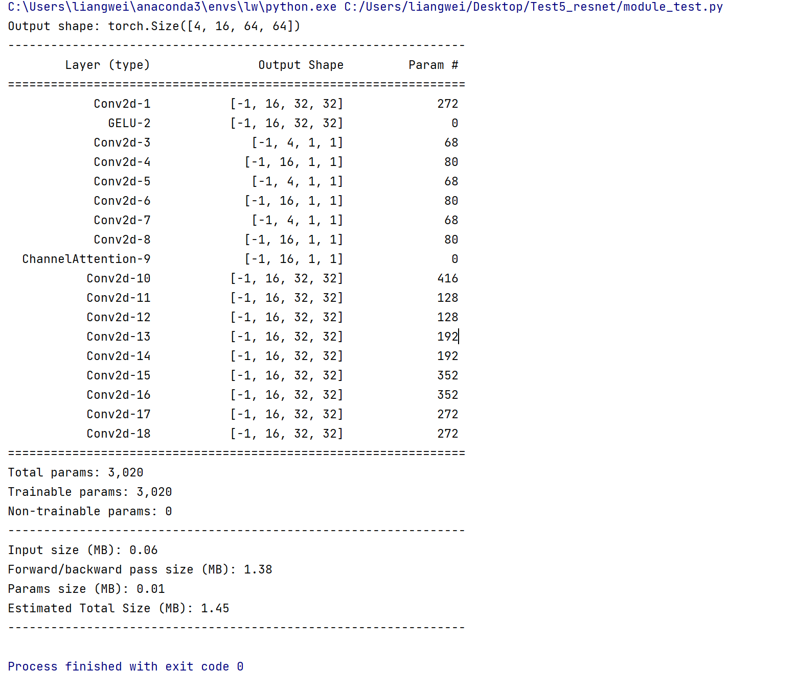

### 6. 实验结果

##### 原模型结果: 93.9

##### 加入GCSA模块后,效果提升1.3

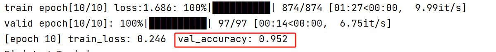


# 模块5 : BFM 双时(Bitemporal)融合模块

### 1. 模块图

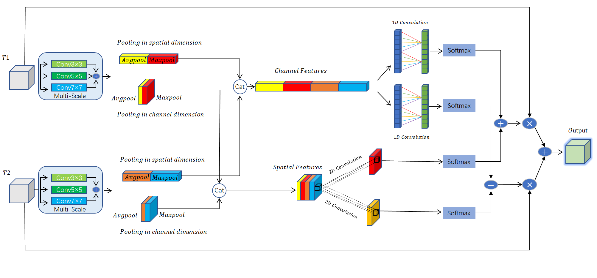

### 2. 模块描述

#### 2.1 输入特征
- 输入包含两个不同时刻的特征图，分别是 `T1` 和 `T2`。

#### 2.2 多尺度特征提取
- 对 `T1` 和 `T2` 分别进行多尺度卷积处理。具体来说：
  - 每个输入特征图通过三个不同尺寸的卷积核：`3x3`、`5x5` 和 `7x7` 进行卷积处理。
  - 卷积处理后，将不同尺寸的卷积结果相加，得到多尺度特征图。

#### 2.3 通道和空间池化
- 对多尺度特征图进行通道和空间维度的池化处理：
  - **通道池化**：对 `T1` 和 `T2` 的多尺度特征图进行全局平均池化 (`AvgPool`) 和全局最大池化 (`MaxPool`)。
  - **空间池化**：对 `T1` 和 `T2` 的多尺度特征图进行空间维度的平均池化和最大池化。

#### 2.4 特征拼接
- 将通道池化和空间池化的结果分别进行拼接，得到通道特征 (`Channel Features`) 和空间特征 (`Spatial Features`)。

#### 2.5 通道注意力计算
- 使用一维卷积 (`1D Convolution`) 对拼接后的通道特征进行卷积，得到两个不同时间点的通道权重。
- 对通道权重进行 `Softmax` 归一化，使权重和为1。

#### 2.6 空间注意力计算
- 使用二维卷积 (`2D Convolution`) 对拼接后的空间特征进行卷积，得到两个不同时间点的空间权重。
- 对空间权重进行 `Softmax` 归一化，使权重和为1。

#### 2.7 注意力融合
- 使用计算出的通道权重和空间权重，对 `T1` 和 `T2` 进行加权相加和加权相乘，得到融合后的特征图。
- 具体步骤包括：
  - 通道权重和空间权重分别与 `T1` 和 `T2` 相乘。
  - 将上述结果相加，得到最终的输出特征图 (`Output`)，实现特征融合。


### 3. 为什么要设计这样的模块?[背景+解决方案]

#### 3.1 整体设计

**背景**：

在时序特征分析和变化检测的计算机视觉任务中，模型的性能依赖于其能够有效地融合来自不同时刻的特征。然而，传统的简单加法或乘法特征融合方法在处理这些任务时存在显著局限性。这些方法容易受到噪声干扰，难以动态调整特征的重要性，并且无法充分利用时序信息。

**解决方案**：

我们提出了一个多尺度双时融合模块（Multi-Scale Bitemporal Fusion  Module），结合了多尺度特征提取和通道及空间注意力机制，旨在提升特征融合的效果和鲁棒性。该模块通过多尺度卷积捕捉不同尺度的特征信息，通过注意力机制动态调整特征的重要性，确保关键特征在融合过程中得到更高的权重。


#### 3.2 多尺度特征提取

**背景：**

传统的单尺度卷积核在捕捉图像中不同尺度和复杂度的特征时存在局限性，无法充分提取全面的信息。此外，不同时间点的特征图可能包含不同的细节信息，需要多尺度特征提取来增强特征表达能力。

**解决方案：**

我们在模块中设计了多尺度特征提取器，对每个输入特征图分别使用 `3x3`、`5x5` 和 `7x7` 的卷积核进行卷积处理。通过多尺度卷积，可以捕捉到不同尺度下的特征信息，将不同卷积结果相加后，形成多尺度特征图，从而增强模型的特征表达能力。


#### 3.3 通道特征处理机制

**背景：**

简单的池化操作可能无法充分提取和区分通道间的复杂关系，尤其是在处理高维数据时，这种方法容易忽略细粒度的通道信息。

**解决方案：**

我们引入了更加细粒度的通道特征处理机制。在对多尺度特征图进行全局平均池化和最大池化后，结合更多的统计信息和变换操作，如标准差池化、最小值池化等，将这些结果拼接起来，并通过卷积操作进一步提取特征。这样，能够更好地捕捉通道间的复杂关系，提升特征处理的精度和效果。


#### 3.4 空间特征处理机制

**背景：**

单一尺度的卷积核可能无法充分捕捉特征图中的多尺度信息，从而限制了模型在处理不同尺度和复杂度特征时的表现。

**解决方案：**

在空间特征处理机制中，我们不仅进行了空间维度的平均池化和最大池化，还引入了不同方向的池化操作，如对角线池化等，以捕捉更多维度的空间信息。这些池化结果拼接后，使用多尺度的卷积操作进一步提取空间特征，从而提高模型对复杂场景和多样化特征的感知能力。


### 4. 代码+注释

```python
import torch
import torch.nn as nn
import math

def kernel_size(in_channel): #计算一维卷积的核大小，利用的是ECA注意力中的参数[动态卷积核]
    k = int((math.log2(in_channel) + 1) // 2)
    return k + 1 if k % 2 == 0 else k

class MultiScaleFeatureExtractor(nn.Module): #多尺度特征提取器[对T1和T2不同时刻的特征进入到不同尺寸的卷积核加强提取]

    def __init__(self, in_channel, out_channel):
        super().__init__()
        # 使用不同尺寸的卷积核进行特征提取
        self.conv1 = nn.Conv2d(in_channel, out_channel, kernel_size=3, padding=1)
        self.conv2 = nn.Conv2d(in_channel, out_channel, kernel_size=5, padding=2)
        self.conv3 = nn.Conv2d(in_channel, out_channel, kernel_size=7, padding=3)
        self.relu = nn.ReLU()

    def forward(self, x):
        # 分别使用不同尺寸的卷积核进行卷积操作
        out1 = self.relu(self.conv1(x))
        out2 = self.relu(self.conv2(x))
        out3 = self.relu(self.conv3(x))
        out = out1 + out2 + out3  # 将不同尺度的特征相加
        return out

class ChannelAttention(nn.Module):

    def __init__(self, in_channel):
        super().__init__()
        # 使用自适应平均池化和最大池化提取全局信息
        self.avg_pool = nn.AdaptiveAvgPool2d(1)
        self.max_pool = nn.AdaptiveMaxPool2d(1)
        self.k = kernel_size(in_channel)
        # 使用一维卷积计算通道注意力
        self.channel_conv1 = nn.Conv1d(4, 1, kernel_size=self.k, padding=self.k // 2)
        self.channel_conv2 = nn.Conv1d(4, 1, kernel_size=self.k, padding=self.k // 2)
        self.softmax = nn.Softmax(dim=0)

    def forward(self, t1, t2):
        # 对 t1 和 t2 进行平均池化和最大池化
        t1_channel_avg_pool = self.avg_pool(t1)
        t1_channel_max_pool = self.max_pool(t1)
        t2_channel_avg_pool = self.avg_pool(t2)
        t2_channel_max_pool = self.max_pool(t2)
        # 将池化结果拼接并转换维度
        channel_pool = torch.cat([
            t1_channel_avg_pool, t1_channel_max_pool,
            t2_channel_avg_pool, t2_channel_max_pool
        ], dim=2).squeeze(-1).transpose(1, 2)
        # 使用一维卷积计算通道注意力
        t1_channel_attention = self.channel_conv1(channel_pool)
        t2_channel_attention = self.channel_conv2(channel_pool)
        # 堆叠并使用Softmax进行归一化
        channel_stack = torch.stack([t1_channel_attention, t2_channel_attention], dim=0)
        channel_stack = self.softmax(channel_stack).transpose(-1, -2).unsqueeze(-1)
        return channel_stack


class SpatialAttention(nn.Module):
    def __init__(self):
        super().__init__()
        # 使用二维卷积计算空间注意力
        self.spatial_conv1 = nn.Conv2d(4, 1, kernel_size=7, padding=3)
        self.spatial_conv2 = nn.Conv2d(4, 1, kernel_size=7, padding=3)
        self.softmax = nn.Softmax(dim=0)

    def forward(self, t1, t2):
        # 计算 t1 和 t2 的平均值和最大值
        t1_spatial_avg_pool = torch.mean(t1, dim=1, keepdim=True)
        t1_spatial_max_pool = torch.max(t1, dim=1, keepdim=True)[0]
        t2_spatial_avg_pool = torch.mean(t2, dim=1, keepdim=True)
        t2_spatial_max_pool = torch.max(t2, dim=1, keepdim=True)[0]
        # 将平均值和最大值拼接
        spatial_pool = torch.cat([
            t1_spatial_avg_pool, t1_spatial_max_pool,
            t2_spatial_avg_pool, t2_spatial_max_pool
        ], dim=1)
        # 使用二维卷积计算空间注意力
        t1_spatial_attention = self.spatial_conv1(spatial_pool)
        t2_spatial_attention = self.spatial_conv2(spatial_pool)
        # 堆叠并使用Softmax进行归一化
        spatial_stack = torch.stack([t1_spatial_attention, t2_spatial_attention], dim=0)
        spatial_stack = self.softmax(spatial_stack)
        return spatial_stack

class TFAM(nn.Module):
    """时序融合注意力模块"""

    def __init__(self, in_channel):
        super().__init__()
        self.channel_attention = ChannelAttention(in_channel)
        self.spatial_attention = SpatialAttention()
        
    def forward(self, t1, t2):
        # 计算通道和空间注意力
        channel_stack = self.channel_attention(t1, t2)
        spatial_stack = self.spatial_attention(t1, t2)
        # 加权相加并进行融合
        stack_attention = channel_stack + spatial_stack + 1
        fuse = stack_attention[0] * t1 + stack_attention[1] * t2
        return fuse

class BFM(nn.Module):
    def __init__(self, in_channel):
        super().__init__()
        self.multi_scale_extractor = MultiScaleFeatureExtractor(in_channel, in_channel)
        self.tfam = TFAM(in_channel)

    def forward(self, t1, t2):
        # 进行多尺度特征提取
        t1_multi_scale = self.multi_scale_extractor(t1)
        t2_multi_scale = self.multi_scale_extractor(t2)
        # 使用TFAM进行融合
        output = self.tfam(t1_multi_scale, t2_multi_scale)
        return output

if __name__ == '__main__':
    model = BFM(in_channel=32).cuda()
    t1 = torch.randn(1, 32, 32, 32).cuda()
    t2 = torch.randn(1, 32, 32, 32).cuda()
    output = model(t1, t2) #这里记住是两个输入,不要被名字唬住了。双时，说通俗点，就是两个不同时刻在同一时间的进行一个融合，或者是在同一个时刻将两个不同的输入进行融合。这里取个名字双时，就是两个输入进行融合，你也可以多加一个T3，叫三时，变成三个输入的融合，完全没问题。
    print(output.shape)

```

**上面是两个输入T1，和T2， 不要被名字唬住了。双时，说通俗点，就是两个不同时刻在同一时间的进行一个融合，或者是在同一个时刻将两个不同的输入进行融合。这里取个名字双时，就是两个输入进行融合，你也可以多加一个T3，叫三时，变成三个输入的融合，完全没问题。**

**我也演示一下多一个时刻T3，其实就是多一个输入的融合，从原来只能两个输入的融合，变成三个输入的融合。代码怎么改，如下：** 

```python
import torch
import torch.nn as nn
import math

def kernel_size(in_channel): 
    """计算一维卷积的核大小，利用的是ECA注意力中的参数"""
    k = int((math.log2(in_channel) + 1) // 2)
    return k + 1 if k % 2 == 0 else k

class MultiScaleFeatureExtractor(nn.Module): 
    """多尺度特征提取器[对T1, T2和T3不同时刻的特征进入到不同尺寸的卷积核加强提取]"""

    def __init__(self, in_channel, out_channel):
        super().__init__()
        # 使用不同尺寸的卷积核进行特征提取
        self.conv1 = nn.Conv2d(in_channel, out_channel, kernel_size=3, padding=1)
        self.conv2 = nn.Conv2d(in_channel, out_channel, kernel_size=5, padding=2)
        self.conv3 = nn.Conv2d(in_channel, out_channel, kernel_size=7, padding=3)
        self.relu = nn.ReLU()

    def forward(self, x):
        # 分别使用不同尺寸的卷积核进行卷积操作
        out1 = self.relu(self.conv1(x))
        out2 = self.relu(self.conv2(x))
        out3 = self.relu(self.conv3(x))
        out = out1 + out2 + out3  # 将不同尺度的特征相加
        return out

class ChannelAttention(nn.Module):

    def __init__(self, in_channel):
        super().__init__()
        # 使用自适应平均池化和最大池化提取全局信息
        self.avg_pool = nn.AdaptiveAvgPool2d(1)
        self.max_pool = nn.AdaptiveMaxPool2d(1)
        self.k = kernel_size(in_channel)
        # 使用一维卷积计算通道注意力
        self.channel_conv1 = nn.Conv1d(6, 1, kernel_size=self.k, padding=self.k // 2)
        self.channel_conv2 = nn.Conv1d(6, 1, kernel_size=self.k, padding=self.k // 2)
        self.channel_conv3 = nn.Conv1d(6, 1, kernel_size=self.k, padding=self.k // 2)
        self.softmax = nn.Softmax(dim=0)

    def forward(self, t1, t2, t3):
        # 对 t1, t2 和 t3 进行平均池化和最大池化
        t1_channel_avg_pool = self.avg_pool(t1)
        t1_channel_max_pool = self.max_pool(t1)
        t2_channel_avg_pool = self.avg_pool(t2)
        t2_channel_max_pool = self.max_pool(t2)
        t3_channel_avg_pool = self.avg_pool(t3)
        t3_channel_max_pool = self.max_pool(t3)
        # 将池化结果拼接并转换维度
        channel_pool = torch.cat([
            t1_channel_avg_pool, t1_channel_max_pool,
            t2_channel_avg_pool, t2_channel_max_pool,
            t3_channel_avg_pool, t3_channel_max_pool
        ], dim=2).squeeze(-1).transpose(1, 2)
        # 使用一维卷积计算通道注意力
        t1_channel_attention = self.channel_conv1(channel_pool)
        t2_channel_attention = self.channel_conv2(channel_pool)
        t3_channel_attention = self.channel_conv3(channel_pool)
        # 堆叠并使用Softmax进行归一化
        channel_stack = torch.stack([t1_channel_attention, t2_channel_attention, t3_channel_attention], dim=0)
        channel_stack = self.softmax(channel_stack).transpose(-1, -2).unsqueeze(-1)
        return channel_stack

class SpatialAttention(nn.Module):

    def __init__(self):
        super().__init__()
        # 使用二维卷积计算空间注意力
        self.spatial_conv1 = nn.Conv2d(6, 1, kernel_size=7, padding=3)
        self.spatial_conv2 = nn.Conv2d(6, 1, kernel_size=7, padding=3)
        self.spatial_conv3 = nn.Conv2d(6, 1, kernel_size=7, padding=3)
        self.softmax = nn.Softmax(dim=0)

    def forward(self, t1, t2, t3):
        # 计算 t1, t2 和 t3 的平均值和最大值
        t1_spatial_avg_pool = torch.mean(t1, dim=1, keepdim=True)
        t1_spatial_max_pool = torch.max(t1, dim=1, keepdim=True)[0]
        t2_spatial_avg_pool = torch.mean(t2, dim=1, keepdim=True)
        t2_spatial_max_pool = torch.max(t2, dim=1, keepdim=True)[0]
        t3_spatial_avg_pool = torch.mean(t3, dim=1, keepdim=True)
        t3_spatial_max_pool = torch.max(t3, dim=1, keepdim=True)[0]
        # 将平均值和最大值拼接
        spatial_pool = torch.cat([
            t1_spatial_avg_pool, t1_spatial_max_pool,
            t2_spatial_avg_pool, t2_spatial_max_pool,
            t3_spatial_avg_pool, t3_spatial_max_pool
        ], dim=1)
        # 使用二维卷积计算空间注意力
        t1_spatial_attention = self.spatial_conv1(spatial_pool)
        t2_spatial_attention = self.spatial_conv2(spatial_pool)
        t3_spatial_attention = self.spatial_conv3(spatial_pool)
        # 堆叠并使用Softmax进行归一化
        spatial_stack = torch.stack([t1_spatial_attention, t2_spatial_attention, t3_spatial_attention], dim=0)
        spatial_stack = self.softmax(spatial_stack)
        return spatial_stack

class TFAM(nn.Module):
    """时序融合注意力模块"""

    def __init__(self, in_channel):
        super().__init__()
        self.channel_attention = ChannelAttention(in_channel)
        self.spatial_attention = SpatialAttention()

    def forward(self, t1, t2, t3):
        # 计算通道和空间注意力
        channel_stack = self.channel_attention(t1, t2, t3)
        spatial_stack = self.spatial_attention(t1, t2, t3)
        # 加权相加并进行融合
        stack_attention = channel_stack + spatial_stack + 1
        fuse = stack_attention[0] * t1 + stack_attention[1] * t2 + stack_attention[2] * t3
        return fuse

class BFM(nn.Module):
    def __init__(self, in_channel):
        super().__init__()
        self.multi_scale_extractor = MultiScaleFeatureExtractor(in_channel, in_channel)
        self.tfam = TFAM(in_channel)

    def forward(self, t1, t2, t3):
        # 进行多尺度特征提取
        t1_multi_scale = self.multi_scale_extractor(t1)
        t2_multi_scale = self.multi_scale_extractor(t2)
        t3_multi_scale = self.multi_scale_extractor(t3)
        # 使用TFAM进行融合
        output = self.tfam(t1_multi_scale, t2_multi_scale, t3_multi_scale)
        return output

if __name__ == '__main__':
    model = BFM(in_channel=32).cuda()
    t1 = torch.randn(1, 32, 32, 32).cuda()
    t2 = torch.randn(1, 32, 32, 32).cuda()
    t3 = torch.randn(1, 32, 32, 32).cuda()
    output = model(t1, t2, t3)
    print(output.shape)

```


### 5. 模型参数量大小

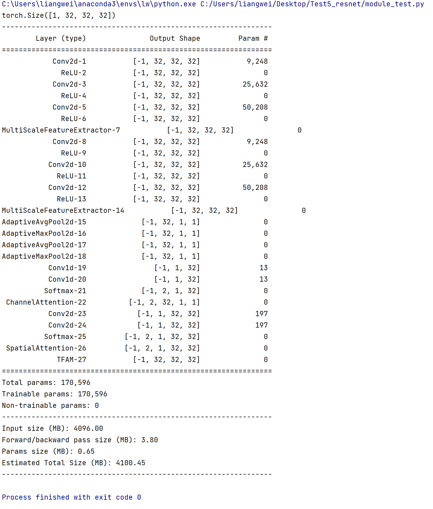

### 6. 实验结果

##### 原模型结果: 93.9

##### 加入GCSA模块后,效果提升0.6【效果真是垃，不过创新还行。】

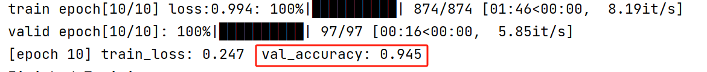


